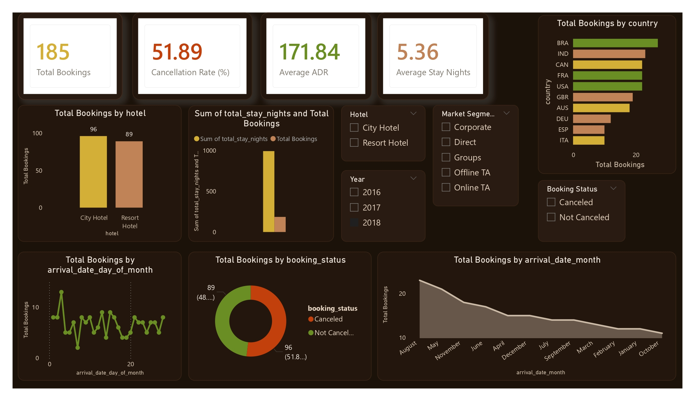

🏨 Hotel Booking Analysis Project

(Python + MySQL + Power BI)

📌 Project Overview

This project is an end-to-end data analytics solution built to analyze hotel booking data and uncover key business insights such as cancellation behavior, seasonal trends, revenue distribution, and customer patterns.

The project demonstrates a complete analytics workflow:

Data Collection → Data Cleaning → SQL Analysis → Python EDA → Power BI Dashboard

🎯 Business Objectives

Analyze hotel booking patterns

Identify cancellation trends

Understand seasonal demand

Evaluate revenue by market segment

Support data-driven decisions to improve occupancy and profitability

🛠 Tools & Technologies Used

Python – Pandas, NumPy, Matplotlib

MySQL – Database storage and SQL analysis

Power BI – Interactive dashboard & visualization

VS Code – Development environment

GitHub – Project version control

📂 Project Structure
Hotel_Booking_Analysis/
│── data/
│   ├── hotel_bookings_sample_550.csv
│   └── cleaned_hotel_bookings.csv
│
│── python/
│   ├── load_data.py
│   └── eda_analysis.py
│
│── sql/
│   └── analysis_queries.sql
│
│── powerbi/
│   └── hotel_dashboard.pbix
│
│── README.md

🔄 Project Workflow
1️⃣ Data Collection

Hotel booking dataset (CSV) containing information about hotel type, cancellations, lead time, country, market segment, ADR, and stay duration.

2️⃣ Data Cleaning & Feature Engineering (Python)

Removed invalid and duplicate values

Handled missing data

Created new features:

Total stay nights

Booking status (Canceled / Not Canceled)

3️⃣ Database Design & SQL Analysis (MySQL)

Created structured database and tables

Inserted records using Python

Performed SQL analysis:

Cancellation rate

Monthly booking trends

Revenue by market segment

Hotel performance comparison

4️⃣ Exploratory Data Analysis (Python)

Cancellation patterns

ADR distribution

Hotel-type performance

Guest and stay behavior

5️⃣ Data Visualization (Power BI)

Built an interactive dashboard with:

KPI cards (Total bookings, ADR, Cancellation rate)

Monthly trend analysis

Hotel-type comparison

Market segment revenue

Country-wise distribution

Dynamic slicers and filters

📊 Dashboard Highlights

📈 Monthly booking trends

🏨 City vs Resort hotel performance

❌ Cancellation behavior

💰 Revenue by market segment

🌍 Guest country distribution

📌  Power BI dashboard screenshots here

🔍 Key Insights

Identified high-cancellation market segments

Discovered seasonal booking peaks

Compared performance between city and resort hotels

Highlighted top revenue-generating channels

🎯 Conclusion

This project demonstrates the ability to work across the full analytics pipeline, from raw data to business insights. It showcases practical skills in Python, SQL, and Power BI, aligned with real-world data analyst responsibilities.

👤 Author

Vedant Dharmale

Aspiring Data Analyst
